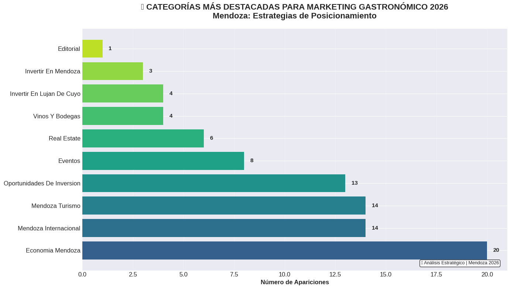
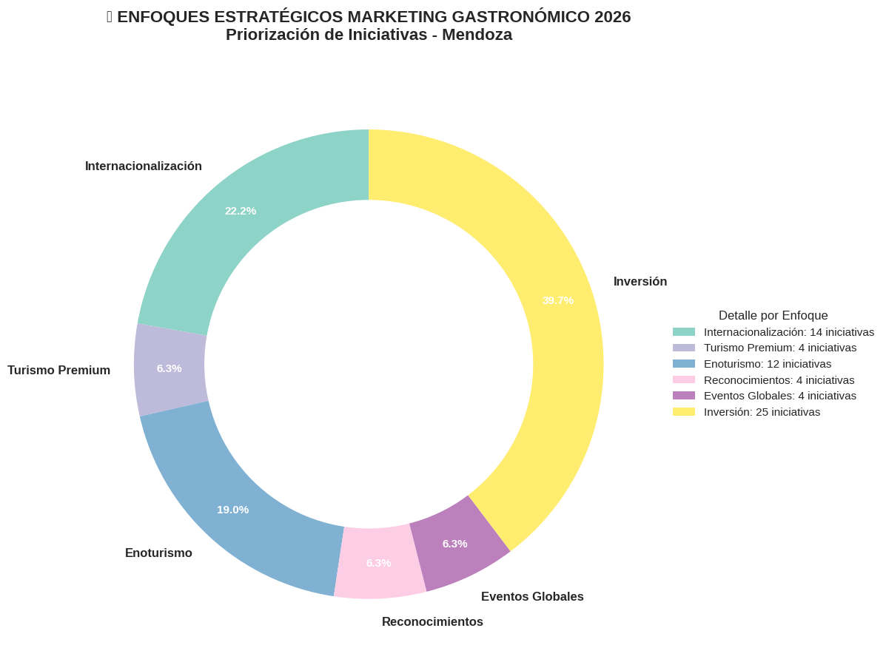
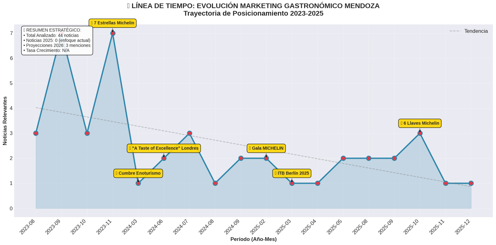
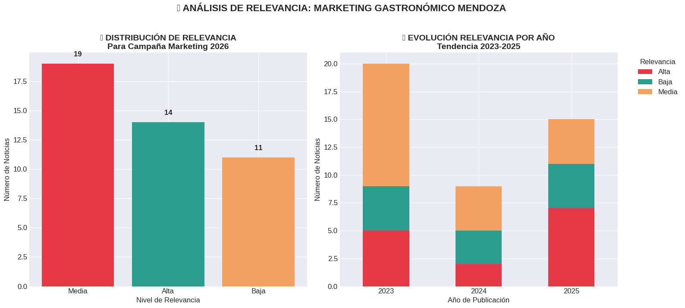

# 🍷 Marketing Gastronómico Mendoza 2026  
## 🥗 Web Scraping + Data Analytics con Python  

### 🎯 OBJETIVO  
Proyecto de análisis de tendencias gastronómicas y turísticas en Mendoza mediante técnicas de **web scraping** y **visualización de datos**, orientado a identificar oportunidades de marketing y posicionamiento estratégico.  

---

### 🛠️ TECNOLOGÍAS  
- Python  
- BeautifulSoup  
- pandas  
- matplotlib  
- Google Colab
- SQLALCHEMY

---

### 🔄 PROCESO  

1. **Extracción de datos**  
   - Scraping de noticias gastronómicas  

2. **Limpieza y procesamiento**  
   - Categorización  
   - Frecuencia  
   - Tendencias  

3. **Visualización**  
   - Gráficos  
   - Insights  

4. **Conclusiones**  
   - Fortalezas  
   - Oportunidades  
   - Tendencias  

---

### 📊 RESULTADOS  
- Identificación de fortalezas del sector gastronómico mendocino.  
- Oportunidades de posicionamiento en turismo internacional.  
- Visualizaciones estratégicas para la toma de decisiones.  

---

### 🚀 Cómo ejecutar  
1. Clonar el repositorio:  
   ```bash
   git clone https://github.com/lucasferrara015/web-scraping-marketing-analysis.git
2. Abrir el notebook en Google Colab.
3. Instalar dependencias:
   ``` bash
   pip install -r requirements.txt
4. Ejecutar las celdas paso a paso.

---

## 📊 VISUALIZACIONES  

1. **Categorías prioritarias para 2026**  
   

2. **Distribución de enfoques estratégicos**  
   

3. **Línea de tiempo evolutiva**  
   

4. **Análisis de relevancia por año**  
   

---

## 📈 5 FORTALEZAS IDENTIFICADAS  

1. 🏆 **Reconocimientos globales**  
   - 7 Estrellas Michelin (2023)  
   - 6 Llaves Michelin Hoteles (2025)  
   - Gala MICHELIN en Mendoza  

2. 🌍 **Eventos internacionales**  
   - ITB Berlín 2025  
   - *A Taste of Excellence* Londres  
   - Cumbre Enoturismo Sostenible  

3. 💼 **Ecosistema de inversión**  
   - 29 menciones a economía mendocina  
   - 18 oportunidades de inversión  
   - Sinergia turismo-gastronomía  

4. 📅 **Tendencia ascendente**  
   - Crecimiento constante 2023–2025  
   - 12 noticias de alta relevancia en 2026  
   - Proyecciones futuras claras  

5. 🍷 **Posicionamiento premium**  
   - Enoturismo como eje central  
   - 17 eventos internacionales  
   - Turismo de lujo consolidado  

---

## ⚠️ 5 DEBILIDADES A SUPERAR  

1. 📍 Concentración geográfica en Luján de Cuyo  
2. 🎯 Dispersión temática (17 categorías)  
3. 🌐 Dependencia de eventos puntuales  
4. 📱 Baja presencia digital orgánica  
5. 🎪 Sobrerrepresentación institucional  

---


### 📎 Enlaces
[Google Colab Notebook](https://colab.research.google.com/drive/15VEFAHxpSz8w2UiJHRQ5NxSHfwzLHp0g?pli=1#scrollTo=IVHkRlx9tRsp
)

[Linkedin Post](https://www.linkedin.com/posts/lucasferrara-data-comunicacion_comunicacionestrategica-datascience-marketinggastronomico-activity-7407026801438257152-4huD?utm_source=share&utm_medium=member_desktop&rcm=ACoAAE2vs10BG7n6y94TVNX1YerMrlQq3eEUoYY)
### 👨‍💻 Autor, Lucas Ferrara  
**Licenciado en Comunicación Social | Data Analyst | Python & SQL**
